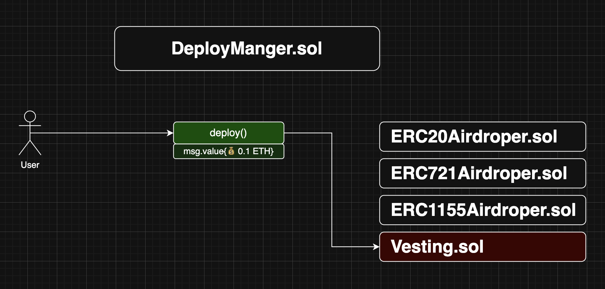

# Smart Deployer

Smart Deployer is a universal solution for organizing and managing paid smart contract deployments.

📚 [Contracts documentation](https://solidityuniversity.github.io/smart-deployer/book/)  
🎓 [Solidity Bootcamp](https://bootcamp.solidity.university)

🧾 Every contract in this repository is fully documented using NatSpec — including deployment instructions, configuration details, and extensibility tips. Developed by Solidity University, following best practices and released under the MIT license, allows developers to:

- Deploy your own `DeployManager.sol`
- Create & connect utility contracts using [template](https://github.com/SolidityUniversity/smart-deployer/blob/main/src/UtilityContract/AbstractUtilityContract.sol)
- Monetize the deployment of utility contracts
- Enable\disable contracts, fees any time

 

> 💡 We are building it as part of the [Solidity University Bootcamp](https://bootcamp.solidity.university) program. Learn Solidity with us at [Solidity University](https://solidity.university)!


---

## 🚀 Getting Started

To start working with this repository, clone it and install all necessary dependencies.

```bash
git clone https://github.com/solidity-university/smart-deployer.git
cd smart-deployer
yarn install
```

> ✅ Make sure you have [Foundry](https://book.getfoundry.sh/getting-started/installation) installed globally before continuing:

---

## 🛠 Build the Project

Compile the contracts using:

```bash
forge build
```

You can run 🧪 tests using:

```bash
forge test
```

## 📚 Generate Documentation

To generate contract documentation:

```bash
forge doc --build --out docs
```

The generated documentation will be available in the `docs/` folder and automatically deploy to [github pages](https://solidityuniversity.github.io/smart-deployer/book/). Make sure there is no `.gitignore` file inside `docs/`.

---

Feel free to contribute or open issues to improve the project 💡
